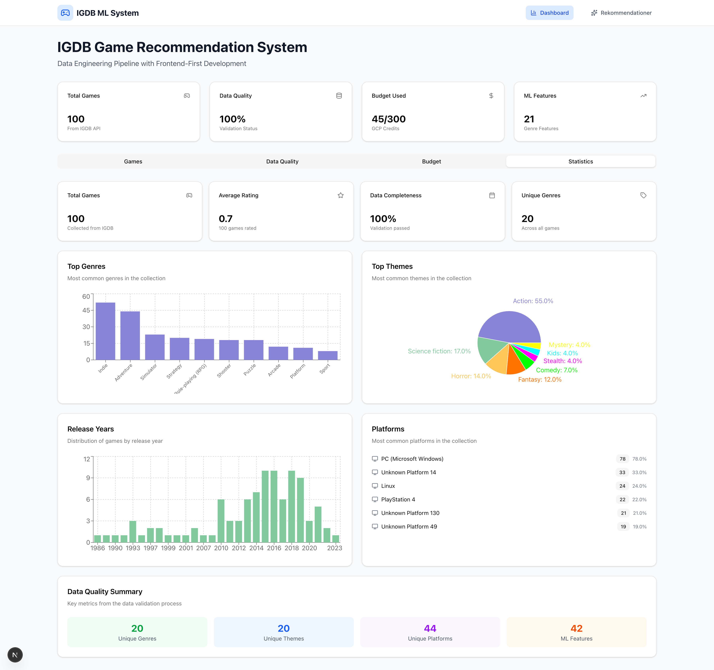
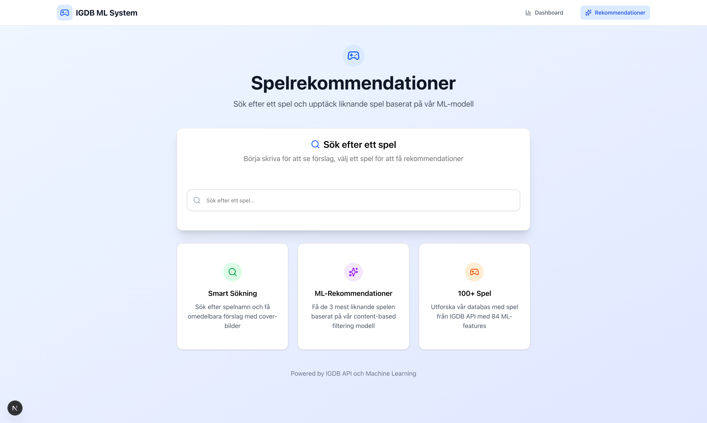

# 🎮 IGDB Spelrekommendationssystem

Ett komplett spelrekommendationssystem med Google-liknande sökinterface, ML-baserade rekommendationer och real-time dashboard.

## 🎯 Vad systemet gör

- **Sök spel** med autocomplete (som Google)
- **Få rekommendationer** på liknande spel baserat på ML
- **Dashboard** med statistik och data quality
- **Real-time data** från IGDB API

## 🚀 Snabbstart för gruppmedlemmar

### **Steg 1: Klona och navigera**
```bash
git clone https://github.com/JohanEnstam/data-engineering.git
cd data-engineering
```

### **Steg 2: Sätt upp Python environment**

#### **Mac/Linux:**
```bash
# Skapa och aktivera venv
python -m venv venv
source venv/bin/activate

# VERIFIERA att det fungerar
which python  # Ska visa: /path/to/project/venv/bin/python
./venv/bin/python --version  # Ska visa Python 3.9.x

# Installera dependencies
pip install -r requirements.txt
```

#### **Windows:**
```bash
# Skapa och aktivera venv
python -m venv venv
venv\Scripts\activate

# VERIFIERA att det fungerar
where python  # Ska visa: C:\path\to\project\venv\Scripts\python.exe
.\venv\Scripts\python.exe --version  # Ska visa Python 3.9.x

# Installera dependencies
pip install -r requirements.txt
```

### **Steg 3: Konfigurera IGDB API credentials**

**Du behöver först:**
- Gå till [Twitch Developer Portal](https://dev.twitch.tv)
- Skapa en ny applikation
- Kopiera Client ID och Client Secret

**Sedan konfigurera:**
```bash
# Kopiera .env template
cp .env.template .env  # Mac/Linux
copy .env.template .env  # Windows

# Redigera .env med dina Twitch credentials
nano .env  # eller använd valfri texteditor
```

### **Steg 4: Samla data från IGDB API**
```bash
# Mac/Linux
./venv/bin/python collect_data.py --games-limit 100

# Windows  
.\venv\Scripts\python.exe collect_data.py --games-limit 100
```

### **Steg 5: Starta systemet**

**Terminal 1 - Backend:**
```bash
# Mac/Linux
./venv/bin/python -m uvicorn src.api_endpoints.main:app --host 0.0.0.0 --port 8000 --reload

# Windows
.\venv\Scripts\python.exe -m uvicorn src.api_endpoints.main:app --host 0.0.0.0 --port 8000 --reload
```

**Terminal 2 - Frontend:**
```bash
cd frontend
npm install
npm run dev
```

### **Steg 6: Öppna systemet**
- **Frontend:** http://localhost:3000
- **Backend API:** http://localhost:8000
- **API Docs:** http://localhost:8000/docs

### 🔍 **Verifiera att allt fungerar:**
```bash
# Kör verification script
./venv/bin/python verify_setup.py  # Mac/Linux
.\venv\Scripts\python.exe verify_setup.py  # Windows
```

### 🎯 **Om du får fel:**
- **"ModuleNotFoundError"** → Använd `./venv/bin/python` istället för `python`
- **"Python version conflict"** → Se troubleshooting-sektionen nedan
- **"Connection refused"** → Kontrollera att backend körs på port 8000

## 📸 **Så här ser systemet ut**

När du har följt installationsstegen ovan kommer du att se:

**Dashboard med kontrollpanel:**


**Sökgränssnitt med rekommendationer:**


## 🎮 Användning

### 📊 **Data Collection Parametrar**
```bash
# Huvudparametrar för collect_data.py

# Antal spel att hämta (default: 1000)
./venv/bin/python collect_data.py --games-limit 100

# Hoppa över data collection, kör endast ETL
./venv/bin/python collect_data.py --skip-collection       

# Hoppa över ETL, kör endast data collection  
./venv/bin/python collect_data.py --skip-etl             

# Hoppa över data validation
./venv/bin/python collect_data.py --skip-validation       
```

**IGDB API Begränsningar:**
- **Rate Limiting:** Automatisk delay (0.25s) mellan requests
- **Batch Size:** Max 500 spel per API-anrop (hanteras automatiskt)
- **Release Dates:** Separata API-anrop för faktiska datum
- **Twitch Credentials:** Krävs för API-åtkomst

**Rekommendationer:**
- **100 spel:** Snabb test (~2-3 minuter)
- **1000 spel:** Bra för utveckling (~10-15 minuter)  
- **5000+ spel:** Produktionsdataset (~30+ minuter)

### 🔧 **Andra viktiga kommandon**
```bash
# Verifiera att environment fungerar
./venv/bin/python verify_setup.py

# Träna ML-modell (efter data collection)
./venv/bin/python -c "from src.models.game_recommender import GameRecommender; GameRecommender().train_model()"

# Starta API med specifika inställningar
./venv/bin/python run_api.py                    # Standard API server
./venv/bin/python -m uvicorn src.api_endpoints.main:app --host 0.0.0.0 --port 8000 --reload

# Kolla data quality
curl http://localhost:8000/api/data-quality     # Data quality report
curl http://localhost:8000/api/lookups          # Genre/theme/platform mappings
```

### 📁 **Viktiga filer och mappar**
- **`.env`** - IGDB API credentials (kopiera från `.env.template`)
- **`data/raw/`** - Rådata från IGDB API (JSON-filer)
- **`data/processed/`** - Bearbetad data (CSV/JSON för ML)
- **`data/models/`** - Tränade ML-modeller (.pkl-filer)
- **`verify_setup.py`** - Environment verification script

### Sök och rekommendationer
1. Gå till http://localhost:3000/recommendations
2. Skriv i sökfältet (t.ex. "space", "tetris", "adventure")
3. Klicka på ett spel för att få top 3 rekommendationer
4. Se cover-bilder och spelinformation

### Dashboard med riktig data
1. Gå till http://localhost:3000
2. **Overview tab:** Se spel i tabellformat (antalet beror på --games-limit)
3. **Statistics tab:** Se data quality metrics:
   - Rating range: 40.0 - 90.0 (genomsnitt: 66.9)
   - 20 unika genres, 20 unika themes, 44 unika platforms
   - 21 genre features, 21 theme features, 45 platform features
4. **Data Quality tab:** Se validering och issues
5. **Budget tab:** Se GCP budget monitoring

## 🏗️ Teknisk Stack

- **Backend:** Python 3.9.x, FastAPI, IGDB API
- **Frontend:** Next.js 14, TypeScript, Tailwind CSS
- **ML:** scikit-learn, pandas, numpy
- **Data:** IGDB API (100+ spel lokalt, skalbar till 1000+)

### 🐍 **Python Version Kompatibilitet**
- **Testat med:** Python 3.9.6
- **Kompatibel med:** Python 3.8, 3.9, 3.10
- **Inte testat med:** Python 3.11, 3.12 (kan orsaka dependency-konflikter)
- **Rekommendation:** Använd Python 3.9.x för bästa kompatibilitet

### 📦 **Dependencies**
**Core:** pandas, numpy, scikit-learn, fastapi, uvicorn
**IGDB:** requests, python-dotenv
**GCP:** google-cloud-billing, google-cloud-monitoring
**Database:** sqlalchemy, psycopg2-binary

**Om du får dependency-konflikter:**
```bash
# Skapa nytt venv med rätt Python version
rm -rf venv
python3.9 -m venv venv  # Eller python3.8
source venv/bin/activate
pip install -r requirements.txt
```

## 📁 Projektstruktur

```
data-engineering/
├── src/                       # Python backend
│   ├── api/                   # IGDB API client
│   ├── data_collectors/       # Data collection
│   ├── data_processing/       # ETL pipeline
│   ├── models/                # ML modeller
│   └── api_endpoints/         # FastAPI endpoints
├── frontend/                  # Next.js app
│   ├── src/app/               # Pages
│   └── src/components/        # React components
├── data/                      # Data storage (lokal)
│   ├── raw/                   # Rådata från IGDB
│   ├── processed/             # Bearbetad data
│   └── models/                # Tränade ML-modeller
└── requirements.txt           # Python dependencies
```

## 🔧 Troubleshooting

### "ModuleNotFoundError: No module named 'pandas'" 🚨 **VANLIGASTE PROBLEMET**
**Problem:** Python är aliased eller venv inte aktiverat korrekt

**Diagnos:**
```bash
# Kontrollera vilken python som används
which python
# Om det visar /usr/bin/python3 eller liknande = PROBLEM!

# Kontrollera om venv är aktiverat
echo $VIRTUAL_ENV
# Ska visa: /path/to/project/venv
```

**Lösningar:**
```bash
# Lösning 1: Aktivera venv korrekt
source venv/bin/activate
which python  # Ska nu visa: /path/to/project/venv/bin/python

# Lösning 2: Använd direkt sökväg (fungerar alltid)
./venv/bin/python collect_data.py --games-limit 100
./venv/bin/python -m uvicorn src.api_endpoints.main:app --host 0.0.0.0 --port 8000 --reload

# Lösning 3: Om du har Python alias, ta bort det
unalias python  # Ta bort alias
source venv/bin/activate
```

### "Connection refused" i frontend
```bash
# Kontrollera att backend körs
curl http://localhost:8000/api/health
# Eller öppna: http://localhost:8000/docs
```

### "No games found" i sökning
```bash
# Kontrollera att data finns
ls -la data/processed/games_*.csv
# Om tomt, kör data collection igen med önskat antal spel
./venv/bin/python collect_data.py --games-limit 100
```

### Python version konflikter
```bash
# Om du har Python 3.11/3.12 och får fel:
# Skapa nytt venv med rätt version
rm -rf venv
python3.9 -m venv venv  # Eller python3.8, python3.10
source venv/bin/activate
pip install -r requirements.txt
```

## 📚 Dokumentation

- [Projektöversikt](PROJECT_OVERVIEW.md) - Detaljerad projektbeskrivning
- [Nästa steg](NEXT_STEPS.md) - Utvecklingsplan
- [Setup Guide](SETUP.md) - Detaljerad installationsguide

## 🤝 Bidrag

1. Skapa feature branch: `git checkout -b feature/ditt-namn`
2. Gör ändringar
3. Committa: `git commit -m "Beskrivning"`
4. Pusha: `git push origin feature/ditt-namn`
5. Skapa Pull Request

---